# Diagramas del Sistema CAL

Código fuente de las 17 figuras del capítulo 6 de la tesis. Estos archivos son la fuente de verdad del diseño: si el código cambia el comportamiento descrito en un diagrama, el diagrama se actualiza en el mismo Pull Request.

Dieciséis figuras están en Mermaid (`.mmd`) y GitHub las dibuja en esta misma página. La Figura 6.12 está en PlantUML (`.puml`), porque Mermaid no tiene notación UML de casos de uso; su imagen está en `fig6_12.png`.

| Figura | Título | Sección de la tesis | Archivo |
|---|---|---|---|
| 6.1 | Diagrama de contexto del Sistema CAL (Nivel 0) | 6.1.1 | [`fig6_01.mmd`](fig6_01.mmd) |
| 6.2 | Diagrama de arquitectura de contenedores del Sistema CAL | 6.1.2 | [`fig6_02.mmd`](fig6_02.mmd) |
| 6.3 | Diagrama de secuencia de autenticación JWT | 6.2.1 | [`fig6_03.mmd`](fig6_03.mmd) |
| 6.4 | Diagrama de flujo del proceso de generación de horario con IA | 6.3.2 | [`fig6_04.mmd`](fig6_04.mmd) |
| 6.5 | Diagrama de secuencia de generación de horario con IA | 6.3.3 | [`fig6_05.mmd`](fig6_05.mmd) |
| 6.6 | Diagrama de flujo del proceso de evaluación docente | 6.4.1 | [`fig6_06.mmd`](fig6_06.mmd) |
| 6.7 | Diagrama de secuencia del pipeline KDD | 6.4.2 | [`fig6_07.mmd`](fig6_07.mmd) |
| 6.8 | Diagrama entidad-relación de usuarios y estructura académica | 6.5.1 | [`fig6_08.mmd`](fig6_08.mmd) |
| 6.9 | Diagrama entidad-relación de recursos y horarios | 6.5.2 | [`fig6_09.mmd`](fig6_09.mmd) |
| 6.10 | Diagrama entidad-relación del módulo de evaluación y KDD | 6.5.3 | [`fig6_10.mmd`](fig6_10.mmd) |
| 6.11 | Diagrama de clases UML del modelo de dominio del Sistema CAL | 6.6 | [`fig6_11.mmd`](fig6_11.mmd) |
| 6.12 | Diagrama de casos de uso UML del Sistema CAL | 6.7 | [`fig6_12.puml`](fig6_12.puml) |
| 6.13 | Diagrama de componentes del frontend React | 6.8 | [`fig6_13.mmd`](fig6_13.mmd) |
| 6.14 | Diagrama de despliegue del Sistema CAL | 6.9 | [`fig6_14.mmd`](fig6_14.mmd) |
| 6.15 | Diagrama de estado del ciclo de vida de la evaluación docente | 6.10.1 | [`fig6_15.mmd`](fig6_15.mmd) |
| 6.16 | Diagrama de estado del ciclo de vida del horario | 6.10.2 | [`fig6_16.mmd`](fig6_16.mmd) |
| 6.17 | Diagrama de flujo del proceso de inscripción de estudiante a grupo | 6.11 | [`fig6_17.mmd`](fig6_17.mmd) |

## Figura 6.1. Diagrama de contexto del Sistema CAL (Nivel 0)

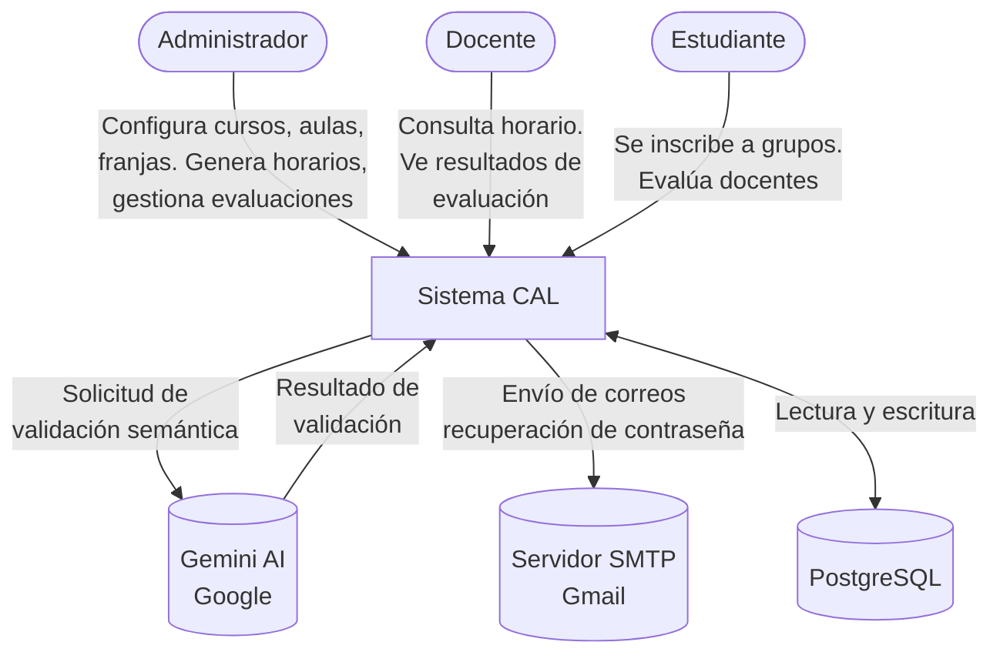
```mermaid
flowchart TB
    Admin(["Administrador"])
    Docente(["Docente"])
    Estudiante(["Estudiante"])
    Sistema["Sistema CAL"]
    Gemini[("Gemini AI<br/>Google")]
    SMTP[("Servidor SMTP<br/>Gmail")]
    DB[("PostgreSQL")]

    Admin -->|"Configura cursos, aulas,<br/>franjas. Genera horarios,<br/>gestiona evaluaciones"| Sistema
    Docente -->|"Consulta horario.<br/>Ve resultados de<br/>evaluación"| Sistema
    Estudiante -->|"Se inscribe a grupos.<br/>Evalúa docentes"| Sistema

    Sistema -->|"Solicitud de<br/>validación semántica"| Gemini
    Gemini -->|"Resultado de<br/>validación"| Sistema
    Sistema -->|"Envío de correos<br/>recuperación de contraseña"| SMTP
    Sistema <-->|"Lectura y escritura"| DB
```

## Figura 6.2. Diagrama de arquitectura de contenedores del Sistema CAL

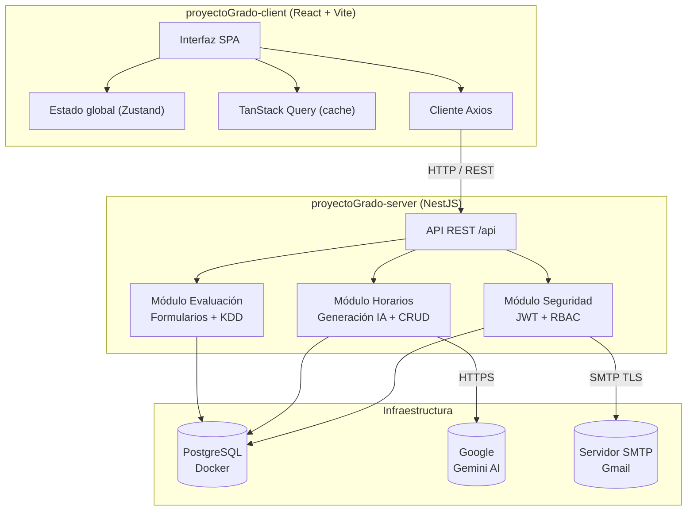
```mermaid
flowchart TB
    subgraph Client["proyectoGrado-client (React + Vite)"]
        SPA["Interfaz SPA"]
        Zustand["Estado global (Zustand)"]
        TanStack["TanStack Query (cache)"]
        Axios["Cliente Axios"]
        SPA --> Zustand
        SPA --> TanStack
        SPA --> Axios
    end

    subgraph Server["proyectoGrado-server (NestJS)"]
        API["API REST /api"]
        Seguridad["Módulo Seguridad<br/>JWT + RBAC"]
        Horarios["Módulo Horarios<br/>Generación IA + CRUD"]
        Evaluacion["Módulo Evaluación<br/>Formularios + KDD"]
        API --> Seguridad
        API --> Horarios
        API --> Evaluacion
    end

    subgraph Infra["Infraestructura"]
        PG[("PostgreSQL<br/>Docker")]
        Gemini[("Google<br/>Gemini AI")]
        SMTP[("Servidor SMTP<br/>Gmail")]
    end

    Axios -->|"HTTP / REST"| API
    Seguridad --> PG
    Seguridad -->|"SMTP TLS"| SMTP
    Horarios --> PG
    Horarios -->|"HTTPS"| Gemini
    Evaluacion --> PG
```

## Figura 6.3. Diagrama de secuencia de autenticación JWT

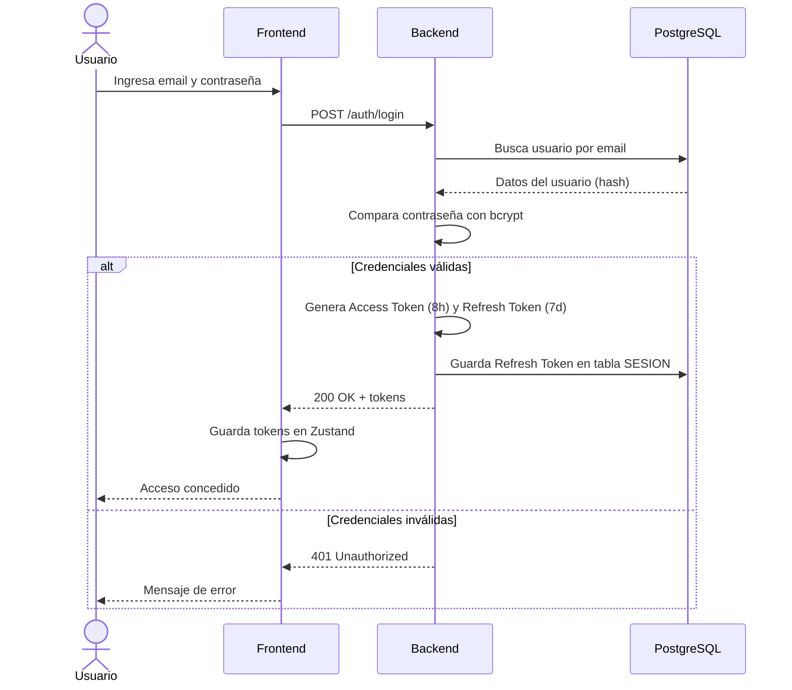
```mermaid
sequenceDiagram
    actor Usuario
    participant Frontend
    participant Backend
    participant PostgreSQL

    Usuario->>Frontend: Ingresa email y contraseña
    Frontend->>Backend: POST /auth/login
    Backend->>PostgreSQL: Busca usuario por email
    PostgreSQL-->>Backend: Datos del usuario (hash)
    Backend->>Backend: Compara contraseña con bcrypt

    alt Credenciales válidas
        Backend->>Backend: Genera Access Token (8h) y Refresh Token (7d)
        Backend->>PostgreSQL: Guarda Refresh Token en tabla SESION
        Backend-->>Frontend: 200 OK + tokens
        Frontend->>Frontend: Guarda tokens en Zustand
        Frontend-->>Usuario: Acceso concedido
    else Credenciales inválidas
        Backend-->>Frontend: 401 Unauthorized
        Frontend-->>Usuario: Mensaje de error
    end
```

## Figura 6.4. Diagrama de flujo del proceso de generación de horario con IA

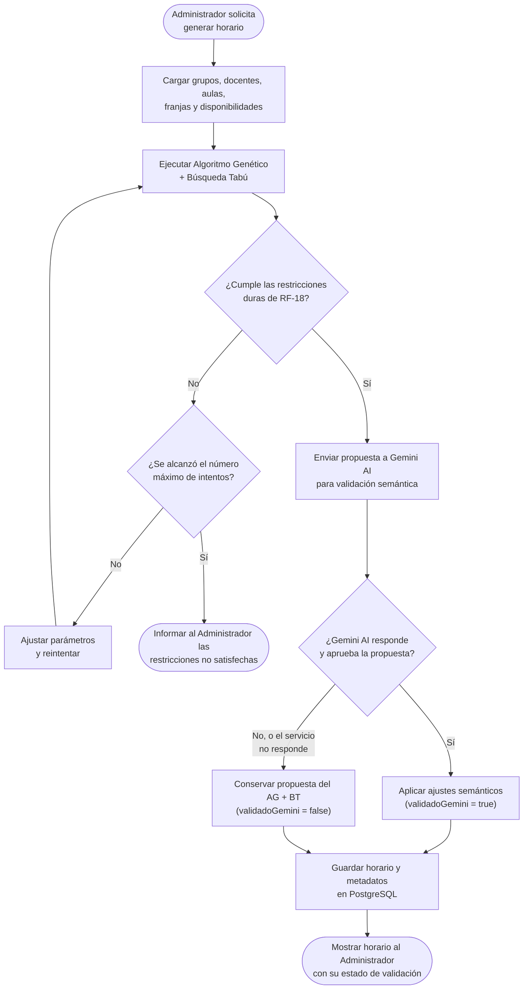
```mermaid
flowchart TD
    Start(["Administrador solicita<br/>generar horario"])
    Cargar["Cargar grupos, docentes, aulas,<br/>franjas y disponibilidades"]
    Ejecutar["Ejecutar Algoritmo Genético<br/>+ Búsqueda Tabú"]
    D1{"¿Cumple las restricciones<br/>duras de RF-18?"}
    DMax{"¿Se alcanzó el número<br/>máximo de intentos?"}
    Ajustar["Ajustar parámetros<br/>y reintentar"]
    Informar(["Informar al Administrador las<br/>restricciones no satisfechas"])
    Enviar["Enviar propuesta a Gemini AI<br/>para validación semántica"]
    D2{"¿Gemini AI responde<br/>y aprueba la propuesta?"}
    Aplicar["Aplicar ajustes semánticos<br/>(validadoGemini = true)"]
    Marcar["Conservar propuesta del AG + BT<br/>(validadoGemini = false)"]
    Guardar["Guardar horario y metadatos<br/>en PostgreSQL"]
    End(["Mostrar horario al Administrador<br/>con su estado de validación"])
    Start --> Cargar --> Ejecutar --> D1
    D1 -->|No| DMax
    DMax -->|No| Ajustar --> Ejecutar
    DMax -->|Sí| Informar
    D1 -->|Sí| Enviar --> D2
    D2 -->|Sí| Aplicar --> Guardar
    D2 -->|"No, o el servicio<br/>no responde"| Marcar --> Guardar
    Guardar --> End
```

## Figura 6.5. Diagrama de secuencia de generación de horario con IA

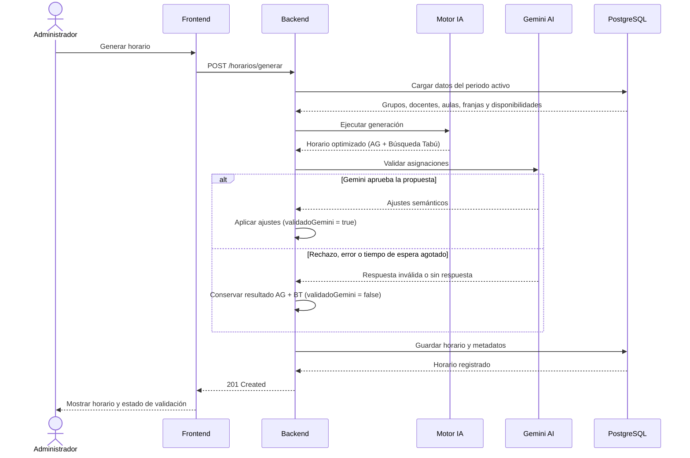
```mermaid
sequenceDiagram
    actor Admin as Administrador
    participant Frontend
    participant Backend
    participant MotorIA as Motor IA
    participant Gemini as Gemini AI
    participant PostgreSQL
    Admin->>Frontend: Generar horario
    Frontend->>Backend: POST /horarios/generar
    Backend->>PostgreSQL: Cargar datos del periodo activo
    PostgreSQL-->>Backend: Grupos, docentes, aulas, franjas y disponibilidades
    Backend->>MotorIA: Ejecutar generación
    MotorIA-->>Backend: Horario optimizado (AG + Búsqueda Tabú)
    Backend->>Gemini: Validar asignaciones
    alt Gemini aprueba la propuesta
        Gemini-->>Backend: Ajustes semánticos
        Backend->>Backend: Aplicar ajustes (validadoGemini = true)
    else Rechazo, error o tiempo de espera agotado
        Gemini-->>Backend: Respuesta inválida o sin respuesta
        Backend->>Backend: Conservar resultado AG + BT (validadoGemini = false)
    end
    Backend->>PostgreSQL: Guardar horario y metadatos
    PostgreSQL-->>Backend: Horario registrado
    Backend-->>Frontend: 201 Created
    Frontend-->>Admin: Mostrar horario y estado de validación
```

## Figura 6.6. Diagrama de flujo del proceso de evaluación docente

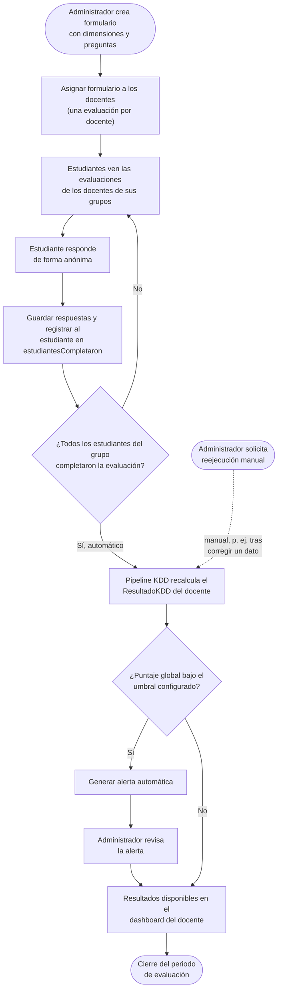
```mermaid
flowchart TD
    Start(["Administrador crea formulario<br/>con dimensiones y preguntas"])
    Asignar["Asignar formulario a los docentes<br/>(una evaluación por docente)"]
    Pendiente["Estudiantes ven las evaluaciones<br/>de los docentes de sus grupos"]
    Responde["Estudiante responde<br/>de forma anónima"]
    Guardar["Guardar respuestas y registrar al<br/>estudiante en estudiantesCompletaron"]
    D1{"¿Todos los estudiantes del grupo<br/>completaron la evaluación?"}
    KDD["Pipeline KDD recalcula el<br/>ResultadoKDD del docente"]
    AdminManual(["Administrador solicita<br/>reejecución manual"])
    D2{"¿Puntaje global bajo el<br/>umbral configurado?"}
    Alerta["Generar alerta automática"]
    Revisa["Administrador revisa<br/>la alerta"]
    Publicar["Resultados disponibles en el<br/>dashboard del docente"]
    End(["Cierre del periodo<br/>de evaluación"])
    Start --> Asignar --> Pendiente
    Pendiente --> Responde --> Guardar --> D1
    D1 -->|No| Pendiente
    D1 -->|"Sí, automático"| KDD
    AdminManual -.->|"manual, p. ej. tras<br/>corregir un dato"| KDD
    KDD --> D2
    D2 -->|Sí| Alerta --> Revisa --> Publicar
    D2 -->|No| Publicar
    Publicar --> End
```

## Figura 6.7. Diagrama de secuencia del pipeline KDD

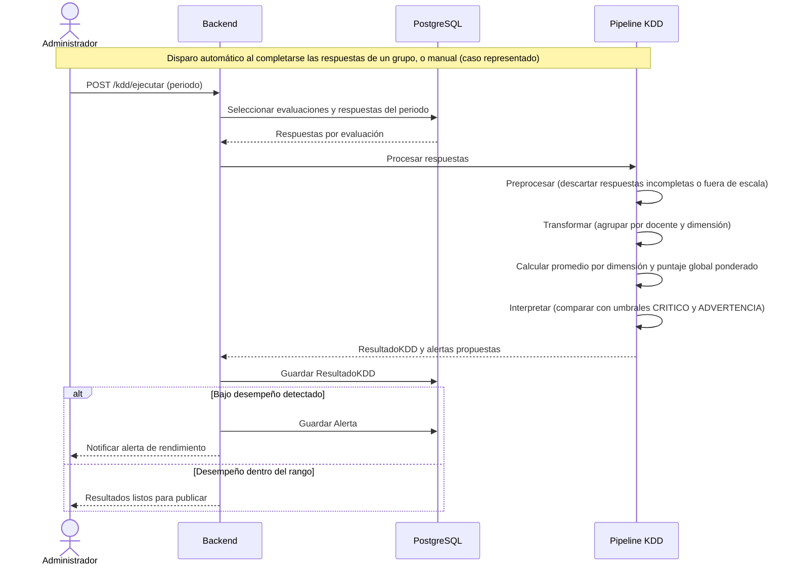
```mermaid
sequenceDiagram
    actor Admin as Administrador
    participant Backend
    participant PostgreSQL
    participant KDD as Pipeline KDD
    Note over Admin,KDD: Disparo automático al completarse las respuestas de un grupo, o manual (caso representado)
    Admin->>Backend: POST /kdd/ejecutar (periodo)
    Backend->>PostgreSQL: Seleccionar evaluaciones y respuestas del periodo
    PostgreSQL-->>Backend: Respuestas por evaluación
    Backend->>KDD: Procesar respuestas
    KDD->>KDD: Preprocesar (descartar respuestas incompletas o fuera de escala)
    KDD->>KDD: Transformar (agrupar por docente y dimensión)
    KDD->>KDD: Calcular promedio por dimensión y puntaje global ponderado
    KDD->>KDD: Interpretar (comparar con umbrales CRITICO y ADVERTENCIA)
    KDD-->>Backend: ResultadoKDD y alertas propuestas
    Backend->>PostgreSQL: Guardar ResultadoKDD
    alt Bajo desempeño detectado
        Backend->>PostgreSQL: Guardar Alerta
        Backend-->>Admin: Notificar alerta de rendimiento
    else Desempeño dentro del rango
        Backend-->>Admin: Resultados listos para publicar
    end
```

## Figura 6.8. Diagrama entidad-relación de usuarios y estructura académica

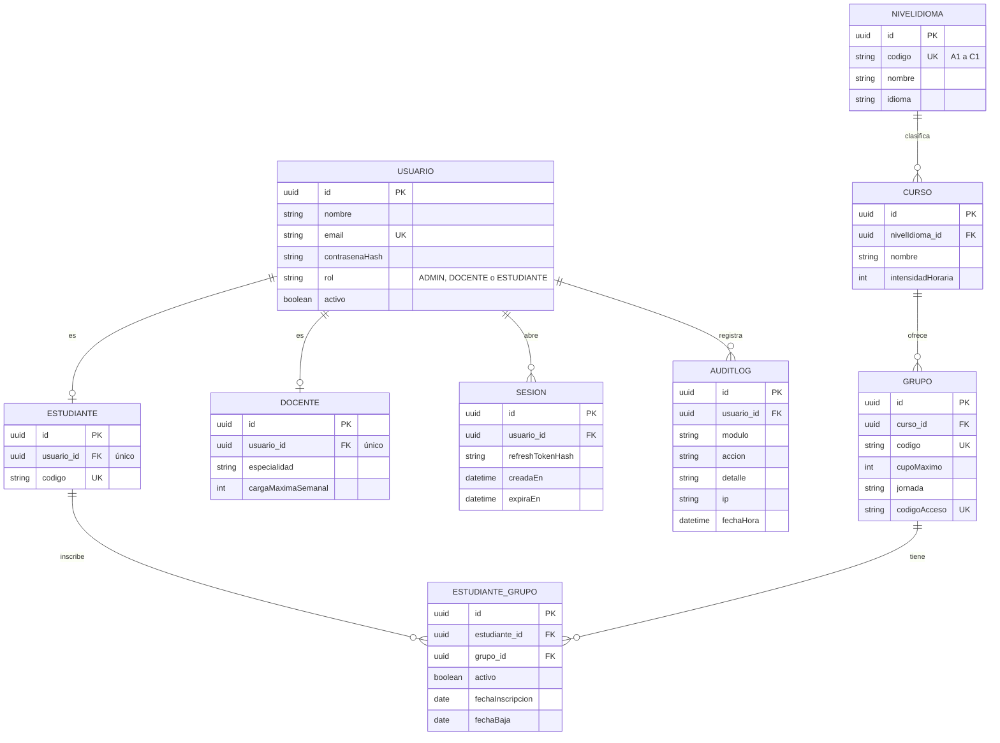
```mermaid
erDiagram
    USUARIO ||--o| ESTUDIANTE : "es"
    USUARIO ||--o| DOCENTE : "es"
    USUARIO ||--o{ SESION : "abre"
    USUARIO ||--o{ AUDITLOG : "registra"
    ESTUDIANTE ||--o{ ESTUDIANTE_GRUPO : "inscribe"
    GRUPO ||--o{ ESTUDIANTE_GRUPO : "tiene"
    CURSO ||--o{ GRUPO : "ofrece"
    NIVELIDIOMA ||--o{ CURSO : "clasifica"
    USUARIO {
        uuid id PK
        string nombre
        string email UK
        string contrasenaHash
        string rol "ADMIN, DOCENTE o ESTUDIANTE"
        boolean activo
    }
    ESTUDIANTE {
        uuid id PK
        uuid usuario_id FK "único"
        string codigo UK
    }
    DOCENTE {
        uuid id PK
        uuid usuario_id FK "único"
        string especialidad
        int cargaMaximaSemanal
    }
    SESION {
        uuid id PK
        uuid usuario_id FK
        string refreshTokenHash
        datetime creadaEn
        datetime expiraEn
    }
    AUDITLOG {
        uuid id PK
        uuid usuario_id FK
        string modulo
        string accion
        string detalle
        string ip
        datetime fechaHora
    }
    ESTUDIANTE_GRUPO {
        uuid id PK
        uuid estudiante_id FK
        uuid grupo_id FK
        boolean activo
        date fechaInscripcion
        date fechaBaja
    }
    GRUPO {
        uuid id PK
        uuid curso_id FK
        string codigo UK
        int cupoMaximo
        string jornada
        string codigoAcceso UK
    }
    CURSO {
        uuid id PK
        uuid nivelIdioma_id FK
        string nombre
        int intensidadHoraria
    }
    NIVELIDIOMA {
        uuid id PK
        string codigo UK "A1 a C1"
        string nombre
        string idioma
    }
```

## Figura 6.9. Diagrama entidad-relación de recursos y horarios

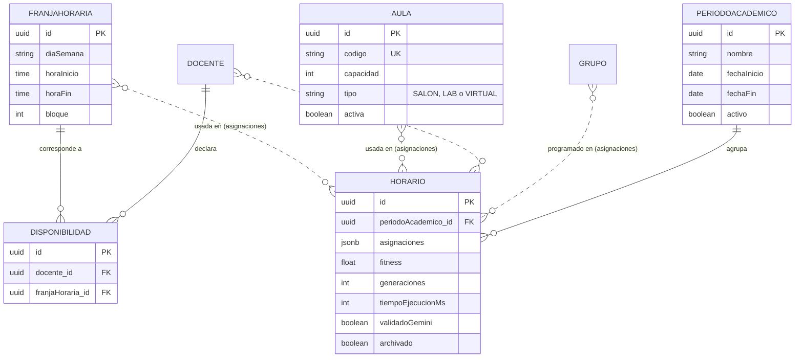
```mermaid
erDiagram
    DOCENTE ||--o{ DISPONIBILIDAD : "declara"
    FRANJAHORARIA ||--o{ DISPONIBILIDAD : "corresponde a"
    PERIODOACADEMICO ||--o{ HORARIO : "agrupa"
    GRUPO }o..o{ HORARIO : "programado en (asignaciones)"
    DOCENTE }o..o{ HORARIO : "asignado en (asignaciones)"
    AULA }o..o{ HORARIO : "usada en (asignaciones)"
    FRANJAHORARIA }o..o{ HORARIO : "usada en (asignaciones)"
    AULA {
        uuid id PK
        string codigo UK
        int capacidad
        string tipo "SALON, LAB o VIRTUAL"
        boolean activa
    }
    FRANJAHORARIA {
        uuid id PK
        string diaSemana
        time horaInicio
        time horaFin
        int bloque
    }
    DISPONIBILIDAD {
        uuid id PK
        uuid docente_id FK
        uuid franjaHoraria_id FK
    }
    PERIODOACADEMICO {
        uuid id PK
        string nombre
        date fechaInicio
        date fechaFin
        boolean activo
    }
    HORARIO {
        uuid id PK
        uuid periodoAcademico_id FK
        jsonb asignaciones
        float fitness
        int generaciones
        int tiempoEjecucionMs
        boolean validadoGemini
        boolean archivado
    }
```

## Figura 6.10. Diagrama entidad-relación del módulo de evaluación y KDD

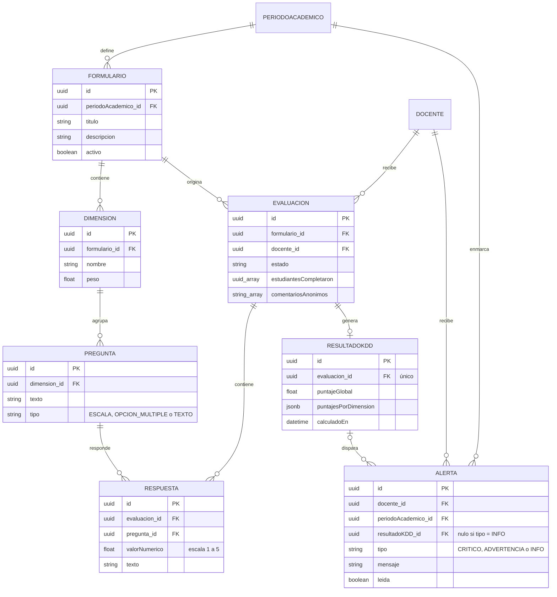
```mermaid
erDiagram
    PERIODOACADEMICO ||--o{ FORMULARIO : "define"
    FORMULARIO ||--o{ DIMENSION : "contiene"
    DIMENSION ||--o{ PREGUNTA : "agrupa"
    FORMULARIO ||--o{ EVALUACION : "origina"
    DOCENTE ||--o{ EVALUACION : "recibe"
    EVALUACION ||--o{ RESPUESTA : "contiene"
    PREGUNTA ||--o{ RESPUESTA : "responde"
    EVALUACION ||--o| RESULTADOKDD : "genera"
    DOCENTE ||--o{ ALERTA : "recibe"
    PERIODOACADEMICO ||--o{ ALERTA : "enmarca"
    RESULTADOKDD |o--o{ ALERTA : "dispara"
    FORMULARIO {
        uuid id PK
        uuid periodoAcademico_id FK
        string titulo
        string descripcion
        boolean activo
    }
    DIMENSION {
        uuid id PK
        uuid formulario_id FK
        string nombre
        float peso
    }
    PREGUNTA {
        uuid id PK
        uuid dimension_id FK
        string texto
        string tipo "ESCALA, OPCION_MULTIPLE o TEXTO"
    }
    EVALUACION {
        uuid id PK
        uuid formulario_id FK
        uuid docente_id FK
        string estado
        uuid_array estudiantesCompletaron
        string_array comentariosAnonimos
    }
    RESPUESTA {
        uuid id PK
        uuid evaluacion_id FK
        uuid pregunta_id FK
        float valorNumerico "escala 1 a 5"
        string texto
    }
    RESULTADOKDD {
        uuid id PK
        uuid evaluacion_id FK "único"
        float puntajeGlobal
        jsonb puntajesPorDimension
        datetime calculadoEn
    }
    ALERTA {
        uuid id PK
        uuid docente_id FK
        uuid periodoAcademico_id FK
        uuid resultadoKDD_id FK "nulo si tipo = INFO"
        string tipo "CRITICO, ADVERTENCIA o INFO"
        string mensaje
        boolean leida
    }
```

## Figura 6.11. Diagrama de clases UML del modelo de dominio del Sistema CAL

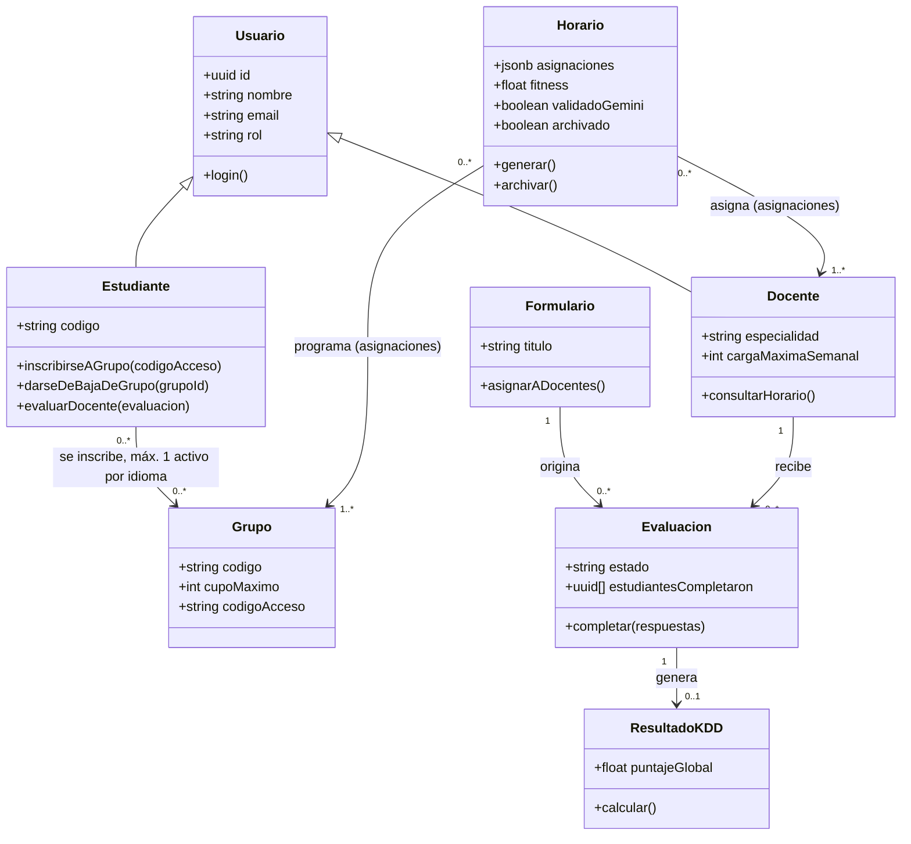
```mermaid
classDiagram
    class Usuario {
        +uuid id
        +string nombre
        +string email
        +string rol
        +login()
    }
    class Docente {
        +string especialidad
        +int cargaMaximaSemanal
        +consultarHorario()
    }
    class Estudiante {
        +string codigo
        +inscribirseAGrupo(codigoAcceso)
        +darseDeBajaDeGrupo(grupoId)
        +evaluarDocente(evaluacion)
    }
    class Grupo {
        +string codigo
        +int cupoMaximo
        +string codigoAcceso
    }
    class Horario {
        +jsonb asignaciones
        +float fitness
        +boolean validadoGemini
        +boolean archivado
        +generar()
        +archivar()
    }
    class Formulario {
        +string titulo
        +asignarADocentes()
    }
    class Evaluacion {
        +string estado
        +uuid[] estudiantesCompletaron
        +completar(respuestas)
    }
    class ResultadoKDD {
        +float puntajeGlobal
        +calcular()
    }
    Usuario <|-- Docente
    Usuario <|-- Estudiante
    Estudiante "0..*" --> "0..*" Grupo : se inscribe, máx. 1 activo por idioma
    Horario "0..*" --> "1..*" Grupo : programa (asignaciones)
    Horario "0..*" --> "1..*" Docente : asigna (asignaciones)
    Formulario "1" --> "0..*" Evaluacion : origina
    Docente "1" --> "0..*" Evaluacion : recibe
    Evaluacion "1" --> "0..1" ResultadoKDD : genera
```

## Figura 6.12. Diagrama de casos de uso UML del Sistema CAL

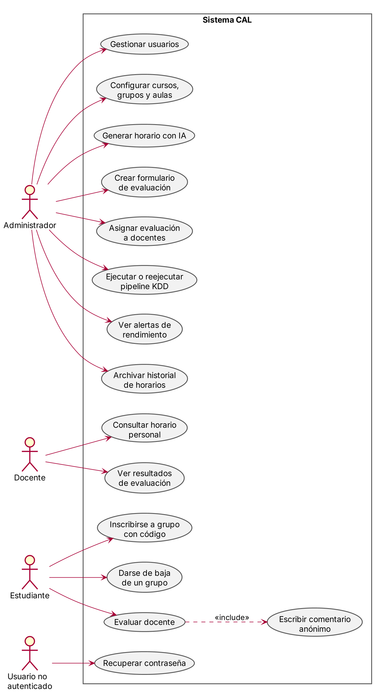

## Figura 6.13. Diagrama de componentes del frontend React

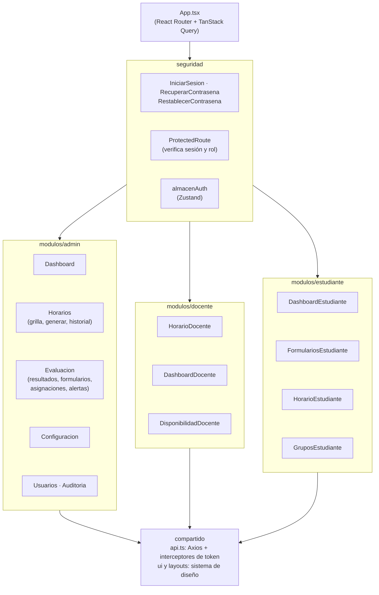
```mermaid
flowchart TB
    App["App.tsx<br/>(React Router + TanStack Query)"]
    subgraph SeguridadM["seguridad"]
        direction LR
        Acceso["IniciarSesion · RecuperarContrasena<br/>RestablecerContrasena"]
        Protected["ProtectedRoute<br/>(verifica sesión y rol)"]
        Store["almacenAuth<br/>(Zustand)"]
    end
    subgraph Admin["modulos/admin"]
        direction TB
        Dashboard["Dashboard"]
        Horarios["Horarios<br/>(grilla, generar, historial)"]
        Evaluacion["Evaluacion<br/>(resultados, formularios,<br/>asignaciones, alertas)"]
        Configuracion["Configuracion"]
        Usuarios["Usuarios · Auditoria"]
    end
    subgraph DocenteM["modulos/docente"]
        direction TB
        HorarioDocente["HorarioDocente"]
        DashboardDocente["DashboardDocente"]
        DisponibilidadDocente["DisponibilidadDocente"]
    end
    subgraph EstudianteM["modulos/estudiante"]
        direction TB
        DashboardEstudiante["DashboardEstudiante"]
        FormulariosEstudiante["FormulariosEstudiante"]
        HorarioEstudiante["HorarioEstudiante"]
        GruposEstudiante["GruposEstudiante"]
    end
    Dashboard ~~~ Horarios ~~~ Evaluacion ~~~ Configuracion ~~~ Usuarios
    HorarioDocente ~~~ DashboardDocente ~~~ DisponibilidadDocente
    DashboardEstudiante ~~~ FormulariosEstudiante ~~~ HorarioEstudiante ~~~ GruposEstudiante
    API["compartido<br/>api.ts: Axios + interceptores de token<br/>ui y layouts: sistema de diseño"]
    App --> SeguridadM
    SeguridadM --> Admin
    SeguridadM --> DocenteM
    SeguridadM --> EstudianteM
    Admin --> API
    DocenteM --> API
    EstudianteM --> API
```

## Figura 6.14. Diagrama de despliegue del Sistema CAL

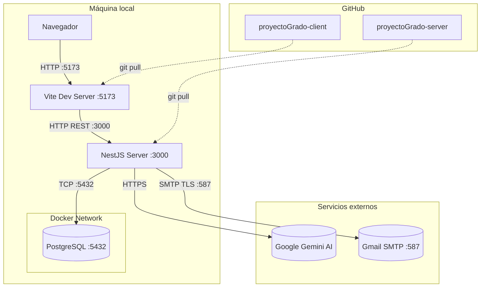
```mermaid
flowchart TB
    subgraph Local["Máquina local"]
        Nav["Navegador"]
        Vite["Vite Dev Server :5173"]
        Nest["NestJS Server :3000"]
        subgraph Docker["Docker Network"]
            PG[("PostgreSQL :5432")]
        end
    end

    subgraph GH["GitHub"]
        RepoClient["proyectoGrado-client"]
        RepoServer["proyectoGrado-server"]
    end

    subgraph Ext["Servicios externos"]
        Gemini[("Google Gemini AI")]
        SMTP[("Gmail SMTP :587")]
    end

    Nav -->|"HTTP :5173"| Vite
    Vite -->|"HTTP REST :3000"| Nest
    Nest -->|"TCP :5432"| PG
    Nest -->|"HTTPS"| Gemini
    Nest -->|"SMTP TLS :587"| SMTP
    RepoClient -.->|"git pull"| Vite
    RepoServer -.->|"git pull"| Nest
```

## Figura 6.15. Diagrama de estado del ciclo de vida de la evaluación docente

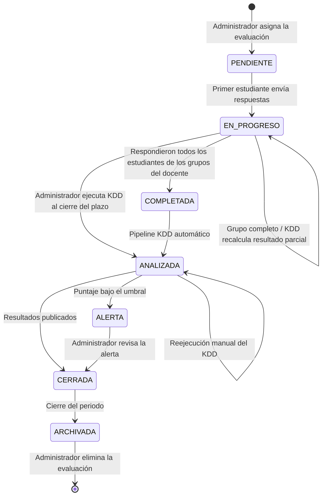
```mermaid
stateDiagram-v2
    [*] --> PENDIENTE : Administrador asigna la evaluación
    PENDIENTE --> EN_PROGRESO : Primer estudiante envía respuestas
    EN_PROGRESO --> EN_PROGRESO : Grupo completo / KDD recalcula resultado parcial
    EN_PROGRESO --> COMPLETADA : Respondieron todos los estudiantes de los grupos del docente
    EN_PROGRESO --> ANALIZADA : Administrador ejecuta KDD al cierre del plazo
    COMPLETADA --> ANALIZADA : Pipeline KDD automático
    ANALIZADA --> ANALIZADA : Reejecución manual del KDD
    ANALIZADA --> ALERTA : Puntaje bajo el umbral
    ANALIZADA --> CERRADA : Resultados publicados
    ALERTA --> CERRADA : Administrador revisa la alerta
    CERRADA --> ARCHIVADA : Cierre del periodo
    ARCHIVADA --> [*] : Administrador elimina la evaluación
```

## Figura 6.16. Diagrama de estado del ciclo de vida del horario

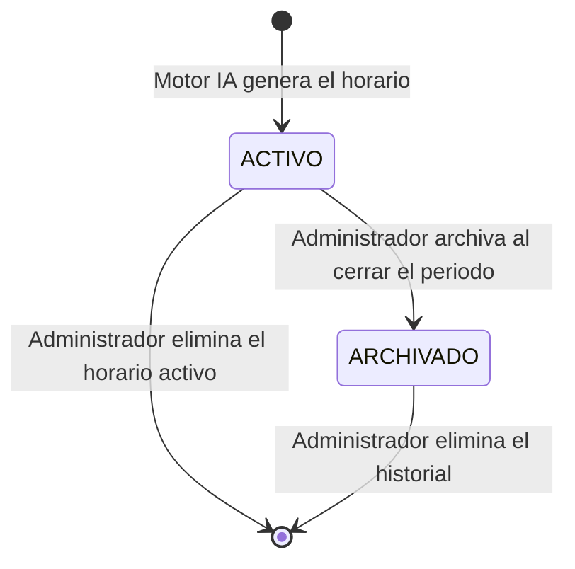
```mermaid
stateDiagram-v2
    [*] --> ACTIVO : Motor IA genera el horario
    ACTIVO --> ARCHIVADO : Administrador archiva al cerrar el periodo
    ACTIVO --> [*] : Administrador elimina el horario activo
    ARCHIVADO --> [*] : Administrador elimina el historial
```

## Figura 6.17. Diagrama de flujo del proceso de inscripción de estudiante a grupo

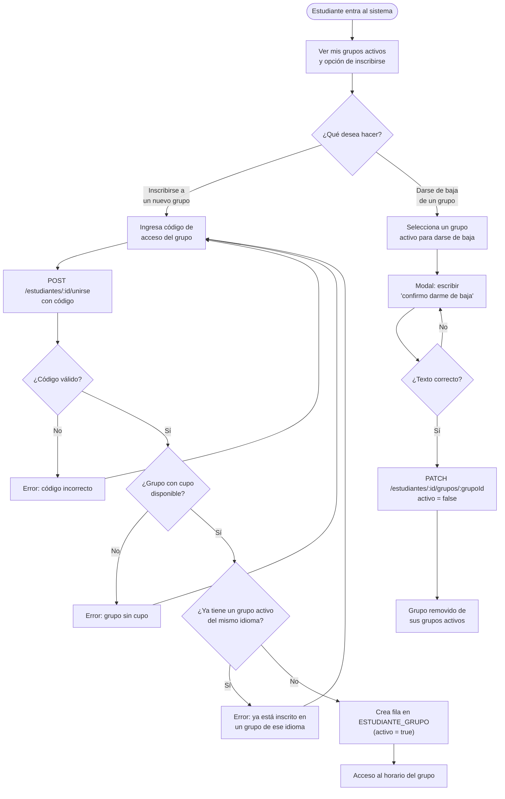
```mermaid
flowchart TD
    Start(["Estudiante entra al sistema"])
    Ver["Ver mis grupos activos<br/>y opción de inscribirse"]
    D1{"¿Qué desea hacer?"}

    Ingresa["Ingresa código de<br/>acceso del grupo"]
    Post["POST /estudiantes/:id/unirse<br/>con código"]
    D2{"¿Código válido?"}
    ErrorCod["Error: código incorrecto"]
    D3{"¿Grupo con cupo<br/>disponible?"}
    ErrorCupo["Error: grupo sin cupo"]
    D4{"¿Ya tiene un grupo activo<br/>del mismo idioma?"}
    ErrorIdioma["Error: ya está inscrito en<br/>un grupo de ese idioma"]
    Crea["Crea fila en ESTUDIANTE_GRUPO<br/>(activo = true)"]
    Acceso["Acceso al horario del grupo"]

    SelecGrupo["Selecciona un grupo<br/>activo para darse de baja"]
    Modal["Modal: escribir<br/>'confirmo darme de baja'"]
    D5{"¿Texto correcto?"}
    Patch["PATCH /estudiantes/:id/grupos/:grupoId<br/>activo = false"]
    Removido["Grupo removido de<br/>sus grupos activos"]

    Start --> Ver --> D1
    D1 -->|"Inscribirse a<br/>un nuevo grupo"| Ingresa --> Post --> D2
    D2 -->|No| ErrorCod --> Ingresa
    D2 -->|Sí| D3
    D3 -->|No| ErrorCupo --> Ingresa
    D3 -->|Sí| D4
    D4 -->|Sí| ErrorIdioma --> Ingresa
    D4 -->|No| Crea --> Acceso

    D1 -->|"Darse de baja<br/>de un grupo"| SelecGrupo --> Modal --> D5
    D5 -->|No| Modal
    D5 -->|Sí| Patch --> Removido
```
